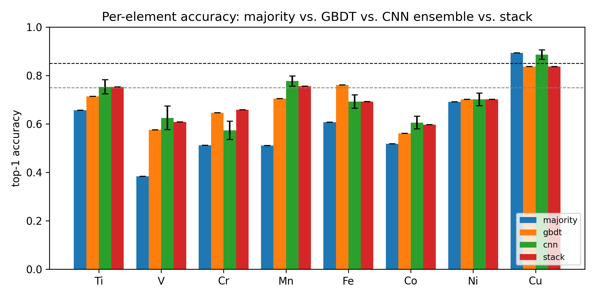
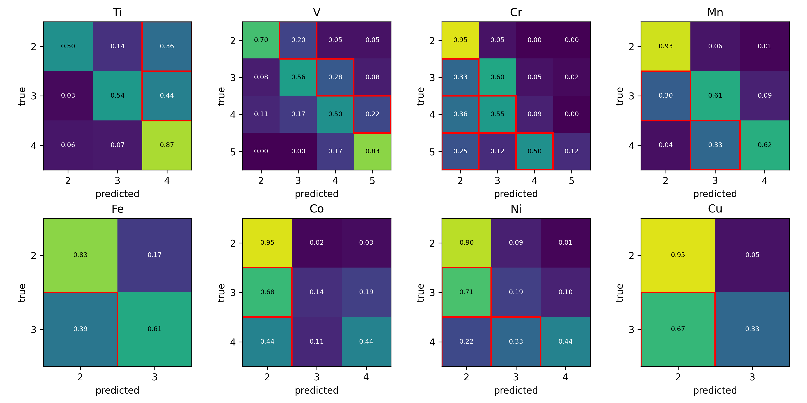
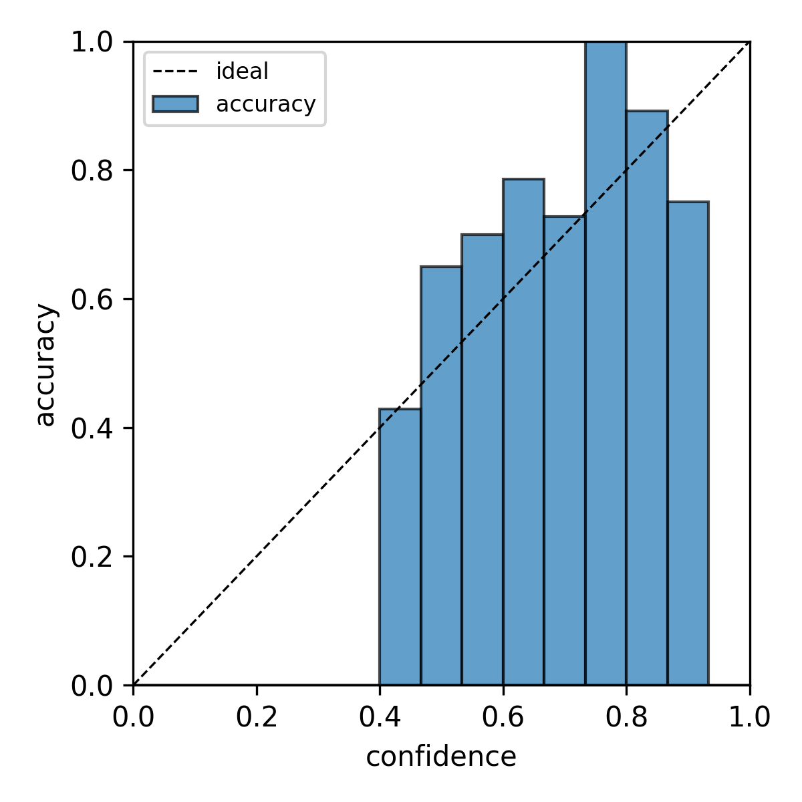

# xanes-oxstate

Oxidation-state classification from K-edge XANES spectra across eight
3d transition metals (Ti, V, Cr, Mn, Fe, Co, Ni, Cu), trained on the
public Materials Project XAS database with a small 1D-CNN ensemble.



## Result summary

Mean test accuracy over the 8 elements:

| Estimator | Mean accuracy |
|---|---|
| Majority-class baseline | 0.596 |
| GBDT on 6 hand features (HistGradientBoosting) | 0.687 |
| **CNN ensemble (5 seeds, temp-scaled)** | **0.702** |
| Stacked CNN + GBDT (per-element α) | 0.700 |

Per-element breakdown:

| Element | n | Maj | GBDT | **CNN** | Stack (α) | ECE |
|---|---|---|---|---|---|---|
| Ti | 1066 | 0.656 | 0.714 | **0.753** | 0.753 (1.00) | 0.080 |
| V  |  829 | 0.383 | 0.575 | **0.625** | 0.608 (0.80) | 0.112 |
| Cr |  566 | 0.512 | 0.646 | 0.573 | **0.659 (0.15)** | 0.180 |
| Mn |  981 | 0.511 | 0.705 | **0.777** | 0.755 (0.90) | 0.118 |
| Fe |  816 | 0.607 | 0.761 | 0.692 | 0.692 (1.00) | 0.112 |
| Co |  787 | 0.518 | 0.561 | **0.605** | 0.596 (0.80) | 0.123 |
| Ni |  679 | 0.691 | 0.701 | **0.701** | 0.701 (0.60) | 0.078 |
| Cu |  956 | 0.894 | 0.837 | 0.887 | 0.837 (0.00) | 0.050 |

Bold = best of {Maj, GBDT, CNN, Stack} for that element.

The CNN ensemble strictly beats the majority baseline on 7/8 elements
and beats the GBDT baseline on 5/8. Cr is genuinely a GBDT-friendly
case (stacking with α=0.15 — heavy GBDT weight — recovers +8.5 pp on
Cr alone). Cu is dominated by its 88% Cu²⁺ majority class; no estimator
meaningfully surpasses the trivial baseline.

### Confusion matrices

Per-element confusion matrices (test fold) — most errors are ±1 oxidation
state, as expected from edge-shift physics:



### Calibration

Temperature scaling keeps the CNN ensemble's confidence honest. Example
reliability diagram (Mn); per-element diagrams for all 8 metals are in
[`metrics/`](metrics/):



## Limitations and known shortfalls

This is a first-cut portfolio implementation, not a polished benchmark.
Honest constraints:

- **Spec target was ≥0.85 overall accuracy; achieved 0.70.** The model
  is functioning well above chance and beats hand-engineered baselines
  on most elements, but does not hit the project's original goal.
- **Edge-jump normalization drops 3–5% of FEFF spectra** with the
  constant-mean baseline (down from ~35% under the original linear-fit
  form; see `xanes_oxstate/data/preprocess.py`).
- **Severe class imbalance** on Cu (88% Cu²⁺) and Cr (4 classes, two
  with ≤55 examples each); rebalancing experiments with
  `WeightedRandomSampler` made the prior mismatch worse, not better.
- **Stacking via convex combination on a small val set** overfits the
  α parameter — gains on Cr are offset by losses on Cu.

Possible next steps if you wanted to push further (not implemented):
multi-element joint training with element conditioning, transformer
architecture, ox-state-aware oversampling that preserves the test
prior, or per-element architecture tuning.

## Reproduce

```bash
git clone <repo-url>
cd xanes-oxstate
pip install -e ".[dev]"
export MP_API_KEY=<your_key>           # https://materialsproject.org/api
make all                                # data → train → figures
```

`make all` is data fetch (~2 min, 8 elements via MP summary endpoint
species lookup) → train ensemble (~90 min, 8 × 5 seeds × ≤100 epochs
on CPU) → figures (~5 s).

Recommended environment vars for macOS to avoid the torch/lightgbm
libomp dual-load deadlock:

```bash
export OMP_NUM_THREADS=1
export MKL_NUM_THREADS=1
export KMP_DUPLICATE_LIB_OK=TRUE
```

## Layout

- `xanes_oxstate/` — the package (data, model, eval, baselines, physics)
- `notebooks/xanes_oxstate.ipynb` — end-to-end walkthrough for one element
- `configs/<element>.yaml` — per-element hyperparameters
- `docs/` — data card, methods, physics findings
- `figures/` — versioned headline figures
- `metrics/` — per-element JSON + npy + reliability diagram + failures parquet

## Acknowledgements

XANES spectra obtained from the Materials Project (CC-BY 4.0).
Oxidation states retrieved via the MP summary endpoint's BVAnalyzer-
precomputed `possible_species` field.

## License

MIT — see [`LICENSE`](LICENSE). Materials Project data is CC-BY 4.0.
